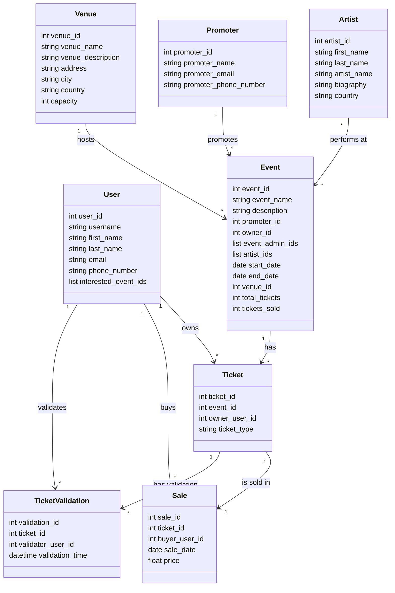

# Event System Class Diagram

```mermaid
classDiagram
    class User {
        int user_id
        string username
        string first_name
        string last_name
        string email
        string phone_number
        list interested_event_ids
    }

    class Artist {
        int artist_id
        string first_name
        string last_name
        string artist_name
        string biography
        string country
    }

    class Event {
        int event_id
        string event_name
        string description
        int promoter_id
        int owner_id
        list event_admin_ids
        list artist_ids
        date start_date
        date end_date
        int venue_id
        int total_tickets
        int tickets_sold
    }

    class Venue {
        int venue_id
        string venue_name
        string venue_description
        string address
        string city
        string country
        int capacity
    }

    class Promoter {
        int promoter_id
        string promoter_name
        string promoter_email
        string promoter_phone_number
    }

    class Ticket {
        int ticket_id
        int event_id
        int owner_user_id
        string ticket_type
    }

    class Sale {
        int sale_id
        int ticket_id
        int buyer_user_id
        date sale_date
        float price
    }

    class TicketValidation {
        int validation_id
        int ticket_id
        int validator_user_id
        datetime validation_time
    }

    %% Relationships
    User "1" --> "*" Ticket : owns
    User "1" --> "*" Sale : buys
    User "1" --> "*" TicketValidation : validates

    Artist "*" --> "*" Event : performs at

    Promoter "1" --> "*" Event : promotes
    Venue "1" --> "*" Event : hosts
    Event "1" --> "*" Ticket : has
    Ticket "1" --> "1" Sale : is sold in
    Ticket "1" --> "*" TicketValidation : has validation
```