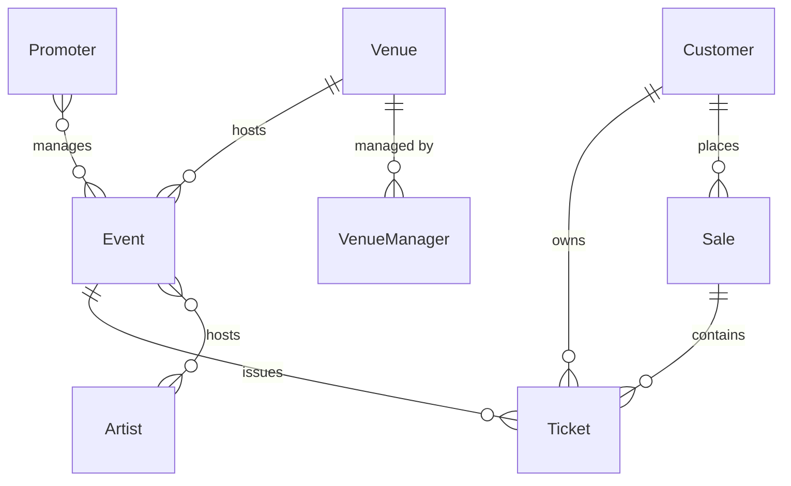

# Event System Class Diagram

```mermaid
erDiagram
  Event }o--o{ Artist       : "hosts"
  Promoter }o--o{ Event     : "manages"
  Customer ||--o{ Sale      : "places"
  Sale ||--o{ Ticket        : "contains"
  Customer ||--o{ Ticket    : "owns"
  Event ||--o{ Ticket       : "issues"
  Venue ||--o{ VenueManager : "managed by"
  Venue ||--o{ Event        : "hosts"
```