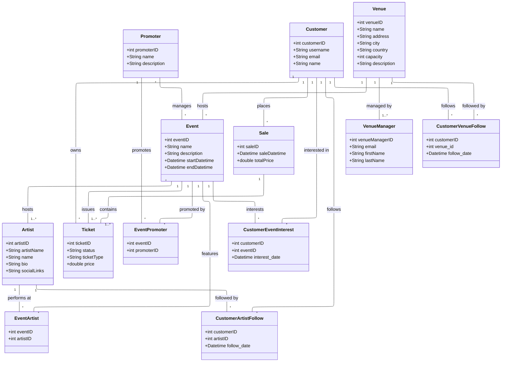

```mermaid
---
config:
  theme: mc
  look: classic
  layout: elk
---
classDiagram
  class Event {
    +int eventID
    +String name
    +String description
    +Datetime startDatetime
    +Datetime endDatetime
  }
  class Artist {
    +int artistID
    +String artistName
    +String name
    +String bio
    +String socialLinks
  }
  class Promoter {
    +int promoterID
    +String name
    +String description
  }
  class Customer {
    +int customerID
    +String username
    +String email
    +String name
  }
  class Sale {
    +int saleID
    +Datetime saleDatetime
    +double totalPrice
  }
  class Ticket {
    +int ticketID
    +String status
    +String ticketType
    +double price
  }
  class Venue {
    +int venueID
    +String name
    +String address
    +String city
    +String country
    +int capacity
    +String description
  }
  class VenueManager {
    +int venueManagerID
    +String email
    +String firstName
    +String lastName
  }
  class EventArtist {
    +int eventID
    +int artistID
  }

  class EventPromoter {
    +int eventID
    +int promoterID
  }

  class CustomerArtistFollow {
    +int customerID
    +int artistID
    +Datetime follow_date
  }

  class CustomerVenueFollow {
    +int customerID
    +int venue_id
    +Datetime follow_date
  }

  class CustomerEventInterest {
    +int customerID
    +int eventID
    +Datetime interest_date
  }
  Event "*" -- "1...*" Artist : hosts
  Promoter "*" -- "*" Event : manages
  Customer "1" -- "*" Sale : places
  Sale "1" -- "1...*" Ticket : contains
  Customer "1" -- "*" Ticket : owns
  Event "1" -- "1...*" Ticket : issues
  Venue "1" -- "1...*" VenueManager : managed by
  Venue "1" -- "*" Event : hosts
  Event "1" -- "*" EventArtist : features
  Artist "1" -- "*" EventArtist : performs at
  Event "1" -- "*" EventPromoter : promoted by
  Promoter "1" -- "*" EventPromoter : promotes
  Customer "1" -- "*" CustomerArtistFollow : follows
  Artist "1" -- "*" CustomerArtistFollow : followed by
  Customer "1" -- "*" CustomerVenueFollow : follows
  Venue "1" -- "*" CustomerVenueFollow : followed by
  Customer "1" -- "*" CustomerEventInterest : interested in
  Event "1" -- "*" CustomerEventInterest : interests
```