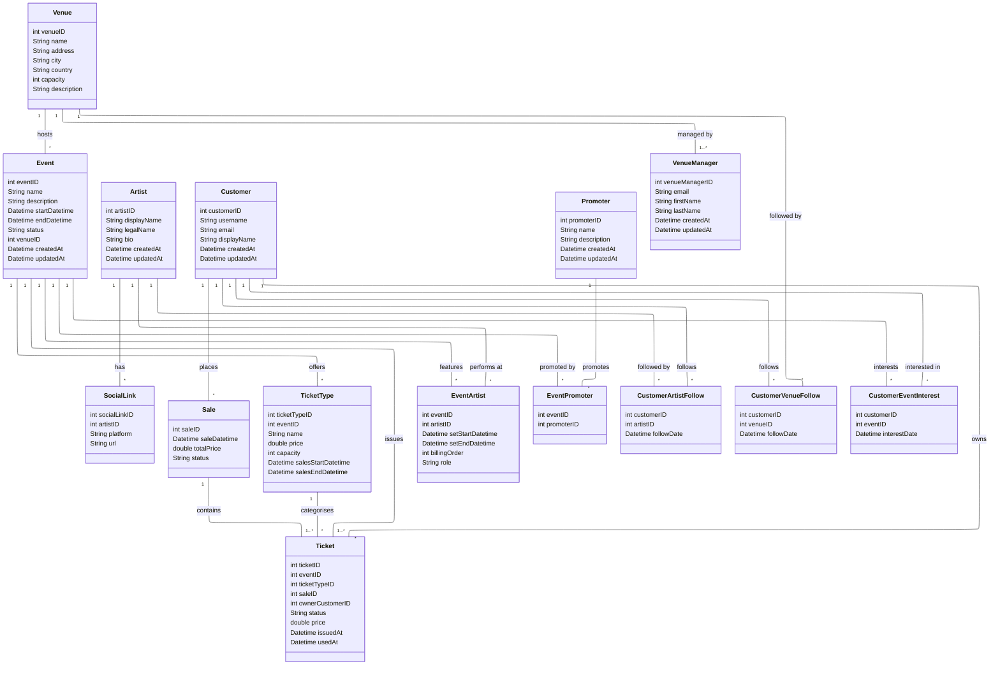

```mermaid
---
config:
  theme: mc
  look: classic
  layout: elk
---
classDiagram
  class Event {
    int eventID
    String name
    String description
    Datetime startDatetime
    Datetime endDatetime
    String status
    int venueID
    Datetime createdAt
    Datetime updatedAt
  }

  class Artist {
    int artistID
    String displayName
    String legalName
    String bio
    Datetime createdAt
    Datetime updatedAt
  }

  class SocialLink {
    int socialLinkID
    int artistID
    String platform
    String url
  }

  class Customer {
    int customerID
    String username
    String email
    String displayName
    Datetime createdAt
    Datetime updatedAt
  }

  class Promoter {
    int promoterID
    String name
    String description
    Datetime createdAt
    Datetime updatedAt
  }

  class Sale {
    int saleID
    Datetime saleDatetime
    double totalPrice
    String status
  }

  class TicketType {
    int ticketTypeID
    int eventID
    String name
    double price
    int capacity
    Datetime salesStartDatetime
    Datetime salesEndDatetime
  }

  class Ticket {
    int ticketID
    int eventID
    int ticketTypeID
    int saleID
    int ownerCustomerID
    String status
    double price
    Datetime issuedAt
    Datetime usedAt
  }

  class Venue {
    int venueID
    String name
    String address
    String city
    String country
    int capacity
    String description
  }

  class VenueManager {
    int venueManagerID
    String email
    String firstName
    String lastName
    Datetime createdAt
    Datetime updatedAt
  }

  class EventArtist {
    int eventID
    int artistID
    Datetime setStartDatetime
    Datetime setEndDatetime
    int billingOrder
    String role
  }

  class EventPromoter {
    int eventID
    int promoterID
  }

  class CustomerArtistFollow {
    int customerID
    int artistID
    Datetime followDate
  }

  class CustomerVenueFollow {
    int customerID
    int venueID
    Datetime followDate
  }

  class CustomerEventInterest {
    int customerID
    int eventID
    Datetime interestDate
  }

  Customer "1" -- "*" Sale : places
  Sale "1" -- "1...*" Ticket : contains
  Customer "1" -- "*" Ticket : owns
  Event "1" -- "1...*" Ticket : issues
  Venue "1" -- "1...*" VenueManager : managed by
  Venue "1" -- "*" Event : hosts
  Customer "1" -- "*" CustomerArtistFollow : follows
  Artist "1" -- "*" CustomerArtistFollow : followed by
  Customer "1" -- "*" CustomerVenueFollow : follows
  Venue "1" -- "*" CustomerVenueFollow : followed by
  Customer "1" -- "*" CustomerEventInterest : interested in
  Event "1" -- "*" CustomerEventInterest : interests
  Artist "1" -- "*" SocialLink : has
  TicketType "1" -- "*" Ticket : categorises
  Event "1" -- "*" TicketType : offers
  Event "1" -- "*" EventArtist : features
  Artist "1" -- "*" EventArtist : performs at
  Event "1" -- "*" EventPromoter : promoted by
  Promoter "1" -- "*" EventPromoter : promotes
```