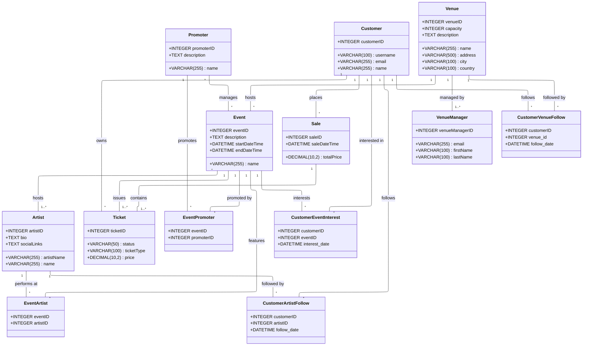

```mermaid
---
config:
  theme: mc
  look: classic
  layout: elk
---
classDiagram
  class Event {
    +INTEGER eventID
    +VARCHAR(255) name
    +TEXT description
    +DATETIME startDateTime
    +DATETIME endDateTime
  }
  class Artist {
    +INTEGER artistID
    +VARCHAR(255) artistName
    +VARCHAR(255) name
    +TEXT bio
    +TEXT socialLinks
  }
  class Promoter {
    +INTEGER promoterID
    +VARCHAR(255) name
    +TEXT description
  }
  class Customer {
    +INTEGER customerID
    +VARCHAR(100) username
    +VARCHAR(255) email
    +VARCHAR(255) name
  }
  class Sale {
    +INTEGER saleID
    +DATETIME saleDateTime
    +DECIMAL(10,2) totalPrice
  }
  class Ticket {
    +INTEGER ticketID
    +VARCHAR(50) status
    +VARCHAR(100) ticketType
    +DECIMAL(10,2) price
  }
  class Venue {
    +INTEGER venueID
    +VARCHAR(255) name
    +VARCHAR(500) address
    +VARCHAR(100) city
    +VARCHAR(100) country
    +INTEGER capacity
    +TEXT description
  }
  class VenueManager {
    +INTEGER venueManagerID
    +VARCHAR(255) email
    +VARCHAR(100) firstName
    +VARCHAR(100) lastName
  }
  class EventArtist {
    +INTEGER eventID
    +INTEGER artistID
  }

  class EventPromoter {
    +INTEGER eventID
    +INTEGER promoterID
  }

  class CustomerArtistFollow {
    +INTEGER customerID
    +INTEGER artistID
    +DATETIME follow_date
  }

  class CustomerVenueFollow {
    +INTEGER customerID
    +INTEGER venue_id
    +DATETIME follow_date
  }

  class CustomerEventInterest {
    +INTEGER customerID
    +INTEGER eventID
    +DATETIME interest_date
  }
  Event "*" -- "1...*" Artist : hosts
  Promoter "*" -- "*" Event : manages
  Customer "1" -- "*" Sale : places
  Sale "1" -- "1...*" Ticket : contains
  Customer "1" -- "*" Ticket : owns
  Event "1" -- "1...*" Ticket : issues
  Venue "1" -- "1...*" VenueManager : managed by
  Venue "1" -- "*" Event : hosts
  Event "1" -- "*" EventArtist : features
  Artist "1" -- "*" EventArtist : performs at
  Event "1" -- "*" EventPromoter : promoted by
  Promoter "1" -- "*" EventPromoter : promotes
  Customer "1" -- "*" CustomerArtistFollow : follows
  Artist "1" -- "*" CustomerArtistFollow : followed by
  Customer "1" -- "*" CustomerVenueFollow : follows
  Venue "1" -- "*" CustomerVenueFollow : followed by
  Customer "1" -- "*" CustomerEventInterest : interested in
  Event "1" -- "*" CustomerEventInterest : interests
```